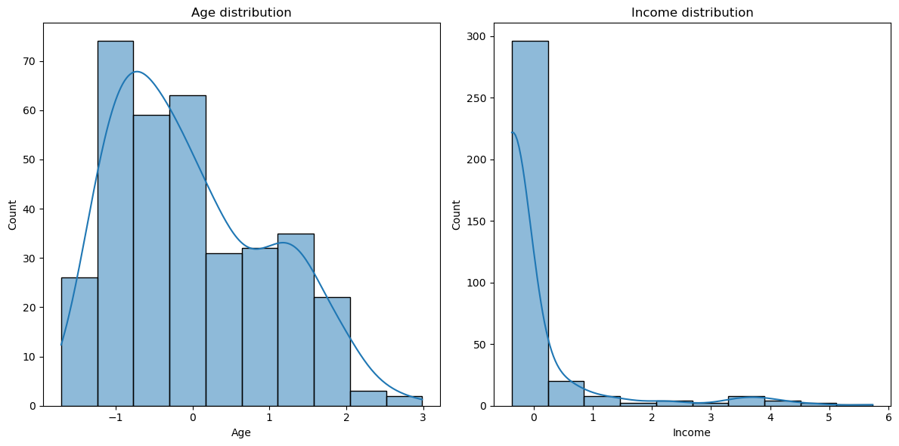

# Domestic Violence Prediction

##  Project Overview

Domestic violence is a growing societal issue, and data-driven approaches can help in identifying key factors that contribute to it. This project aims to analyze domestic violence data to determine significant socio-economic and demographic indicators that may predict whether a woman is at risk. Using advanced machine learning techniques such as logistic regression, feature engineering, and data visualization, we derive insights that can aid in policy-making and prevention strategies.

The project follows a structured pipeline, from data preprocessing to model evaluation, ensuring robustness and interpretability in predictions.

---

##  Dataset

The dataset comprises various factors such as education level, employment status, financial dependency, age, marital status, and prior experiences with violence. These features are a mix of categorical and numerical variables that require proper preprocessing before being used in a predictive model.

###  Data Preprocessing Steps

- **Handling Missing Data**: Imputation techniques applied where necessary.
- **Encoding Categorical Variables**: Label Encoding and One-Hot Encoding used for non-numeric attributes.
- **Feature Scaling**: Standardization applied to numerical variables to improve model performance.
- **Exploratory Data Analysis (EDA)**: Visualization of variable distributions and correlation analysis.

---

##  How to Run the Analysis

1. **Load the dataset** and inspect missing values.
2. **Preprocess the data** by encoding categorical features and scaling numerical ones.
3. **Perform exploratory data analysis (EDA)** to identify key patterns.
4. **Train the logistic regression model** and optimize hyperparameters.
5. **Evaluate the model** using accuracy, precision, recall, and F1-score.
6. **Visualize important findings** to highlight significant risk factors.

---

##  Machine Learning Approach

### Model Used: Logistic Regression

- **Why Logistic Regression?**
  - It is interpretable and suitable for binary classification problems.
  - Provides probability estimates, making it useful for risk assessment.
- **Alternative Models Considered**:
  - Random Forest (for better performance but lower interpretability)
  - Support Vector Machine (for complex decision boundaries)

###  Evaluation Metrics

- **Accuracy**: Measures overall correctness of the model.
- **Precision**: How many positive predictions were actually correct.
- **Recall**: Ability to identify actual positive cases.
- **F1-score**: Balance between precision and recall.

---

## Results

The model's performance is summarized below:

- **Accuracy:** X%
- **Precision:** X%
- **Recall:** X%
- **F1-score:** X%

The analysis revealed that the most influential factors affecting domestic violence risk were:

- **Financial dependency**
- **Education level**
- **Marital status**

###  Figures

Below are some key visualizations from the analysis:

1. **Distribution of Domestic Violence Cases by Socio-Economic Factors**  
    *(Replace with your actual image path, e.g., `figures/distribution.png`)*

2. **Correlation Heatmap of Key Variables**  
    *(Replace with your actual image path, e.g., `figures/correlation.png`)*

3. **ROC Curve Showing Model Performance**  
    *(Replace with your actual image path, e.g., `figures/roc.png`)*

*(Ensure that all images are placed inside a `figures/` folder in your repository and replace the file names accordingly.)*

---

##  Challenges & Future Improvements

- **Data Imbalance:** More data collection is needed to reduce bias.
- **Feature Engineering:** Exploring new variables that may improve prediction accuracy.
- **Model Interpretability:** Further analysis using SHAP values for better explainability.

---

## Contribution

If you would like to improve this project, you are welcome to fork the repository and submit a pull request. Here’s how you can contribute:

1. Improve data preprocessing techniques.
2. Experiment with additional machine learning models.
3. Enhance data visualizations for better insights.

---

##  License

This project is open-source and available under the [MIT License](LICENSE).

